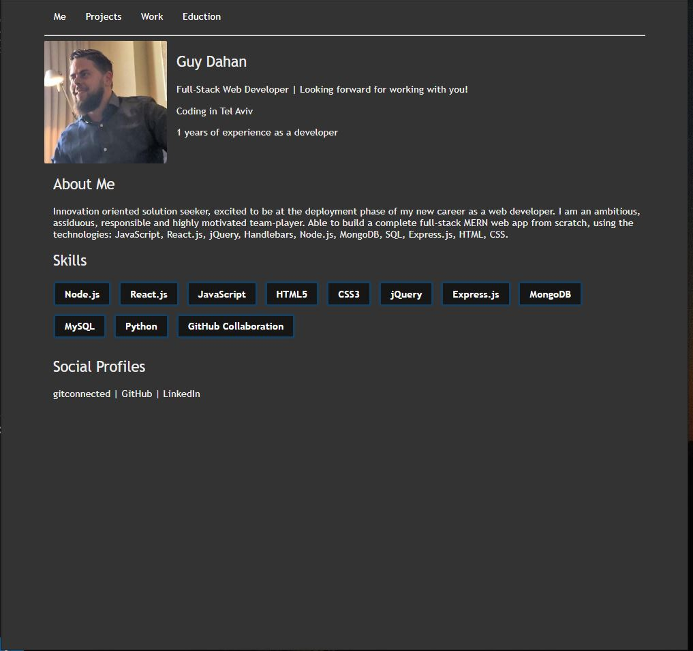
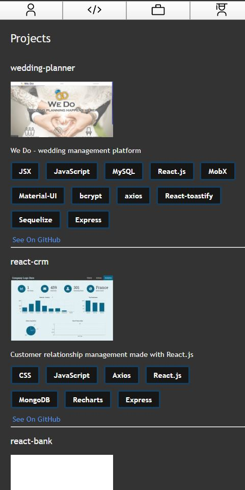

# Table Of Contents

- [Portfolio](#portfolio)
  - [Running the project](#running-the-project)
  - [Screenshots](#screenshots)
    - [Main View](#main-view)
    - [Mobile View](#mobile-view)
  - [Techstack](#tech-stack)
  - [TODO](#todo)

# Portfolio Website

This portfolio website is a front-end personal portfolio app built with React.js. Data(JSON) is requested from GitConnected API and this being being parsed accordingly.

Demo: https://guydahn-portfolio.herokuapp.com/

## Running the project

1. Clone the repo.
2. Run `npm install`.
3. Run `npm start`.
4. Navigate to `http://localhost:3000` (or other port based on the message in the console).

## Screenshots

### Main View

Main screen (desktop view)

### Mobile View

A user can see their budget and all the available movies to rent.

## Techstack
- React.js
- carbon icons
- styled components

## TODO

- [x] Create decent README.md file.
- [x] Fix all projects descriptions.
- [x] Work page - add data.
- [x] Education page - add data.
- [ ] Add toggle dark/light mode option

